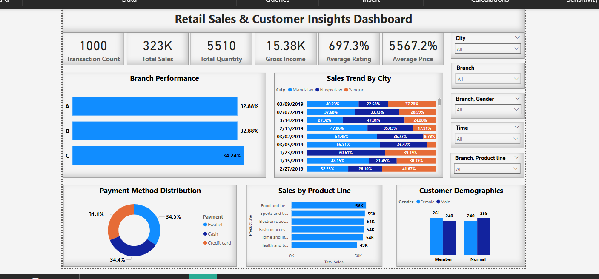

# Retail Sales & Customer Insights Dashboard

 ## Introduction
The Retail Sales & Customer Insights Dashboard is an interactive business tool designed to analyze transactional sales data and customer behavior across multiple branches and product lines. It provides valuable insights to decision-making, helping them understand sales patterns, customer preferences, and operational performance.
## Problem Statement
Retail businesses often struggle to monitor and interpret large volumes of sales data spread across various locations, time periods, and product categories. Without an intuitive reporting solution, key trends and inefficiencies go unnoticed.
This project addresses the need for a consolidated dashboard that allows stakeholders to:

 - Evaluate branch performance

 - Track sales trends by city

 - Understand customer demographics

 - Identify top-performing products

 - Analyze preferred payment methods
## Skills Demonstrated
 - Power BI: Data modeling, DAX measures, and interactive visualizations

 - Data Analysis: Sales trend evaluation, customer segmentation, and performance comparison

 - Data Wrangling: Cleaning and transforming transactional records for accuracy

 - Storytelling with Data: Building insights into visual reports for business use

 - Dashboard Design: UI/UX layout optimized for executive reporting
## Stakeholders
 - Retail Business Managers: To track revenue and profitability by product and branch

 - Sales Executives: To measure customer behavior and optimize marketing strategies

 - Finance Department: To monitor income, payments, and pricing distribution

 - Customer Insights Analysts: To identify customer trends and retention opportunities
## Metadata
 - File Extension: .xlsx
 - Number of Rows: 1001
 - Number of Fields: 17
   
 ## Key Insights
 - Branch C recorded the highest sales contribution (34.24%), slightly outperforming Branch A and B.

 - Cash and E-wallet are the most used payment methods, making up nearly 70% of all payments.

 - Food and beverages is the top-performing product category, with over 56K in sales.

 - Yangon leads in daily sales volumes compared to Mandalay and Naypyitaw.

 - Members and Normal customers are nearly evenly distributed across genders, indicating balanced engagement.

## Recommendations
 - Focus marketing efforts on product lines such as Food & Beverages and Sports & Travel which show higher sales volumes.

 - Promote digital payments (e-wallets) by offering incentives, as they are already widely used.

 - Increase inventory and staff resources in Branch C to support its sales potential.

 - Enhance loyalty programs to convert Normal customers into Members, boosting retention.

 - Monitor low-performing product lines (e.g., Health & Beauty) for promotional opportunities or reconsider stocking strategy.
## Conclusion
The Retail Sales & Customer Insights Dashboard empowers stakeholders to make data-driven decisions by presenting a clear, holistic view of the retail business. Through visual storytelling and interactive exploration, this dashboard transforms raw sales data into meaningful insights that improve strategic planning and customer engagement.

   

